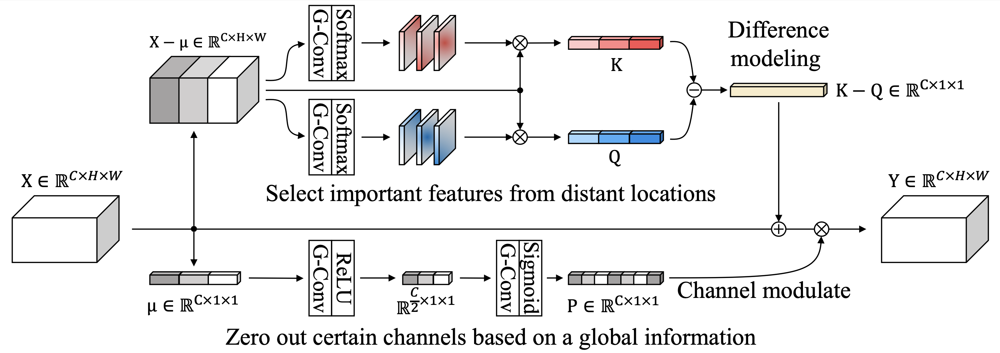

# Attend And Compare
This is an official implementation of the paper [Learning Visual Context by Comparison](https://arxiv.org/abs/2007.07506).





## Usage
```python
import torch
from context_module import ACM
x1 = torch.randn(256 * 20 * 20 * 5).view(5, 256, 20, 20).float()
acm = ACM(num_heads=32, num_features=256)
acm.init_parameters()
y, dp = acm(x1)
print(y.shape)   # output
print(dp.shape)  # dot product for orthogonal loss
```

## Examples
CXR14 and COCO experiment codes are provided in the directories below.

1. [cxr14](cxr14) 
1. [coco](coco) 


## Citation
Minchul Kim*, Jongchan Park*, Seil Na, Chang Min Park, and Donggeun Yoo (* equal contribution). Learning Visual Context by Comparison. In The European Conference on Computer Vision (ECCV), August 2020. 

Bibtex
```
@inproceedings{kim2020acm,
  title={Learning Visual Context by Comparison},
  author={Kim, Minchul and Park, Jongchan and Na, Seil and Park, Chang Min and Yoo, Donggeun},
  booktitle={Proceedings of the European Conference on Computer Vision (ECCV)},
  pages={},
  year={2020}
}
```
